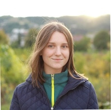

# QR Code

# Profile Info

 

**Name**:  Petra Florkova 

**School**: TUKE Fakulta elektrotechniky a informatiky

**Hobbies**: Photography

**Colleague**: [Martin Homola](mato.md)

|  |  |
| :------------------------: | :----------------------: |
| **Full moon**              | **Sunset**               |
| *Bathing in the ethereal glow of the full moon in the tranquil mountains. 🌕 #MoonlitNights* | *Chasing the sun as it paints the sky in hues of gold over the endless fields. 🌅 #SunsetMagic* |
|  |  |
| **Old tree**              | **Leafs**               |
| *Beneath the wise branches of an ancient tree, where secrets whisper through the leaves. 🌳 #TimelessWisdom* | *Glistening leaves kissed by crystal-clear waters, a symphony of nature's beauty. 🍃💧 #NatureHarmony* |
|  |  |
| **Beach Sunset**              | **Waterfall**               |
| *Sinking beneath the horizon, the sun sets the beach ablaze in a fiery embrace. 🌅🏖️ #BeachSunsets* | *Lost in the thundering roar of a majestic waterfall, where nature's power takes your breath away. 🌊 #WaterfallWonders* |
